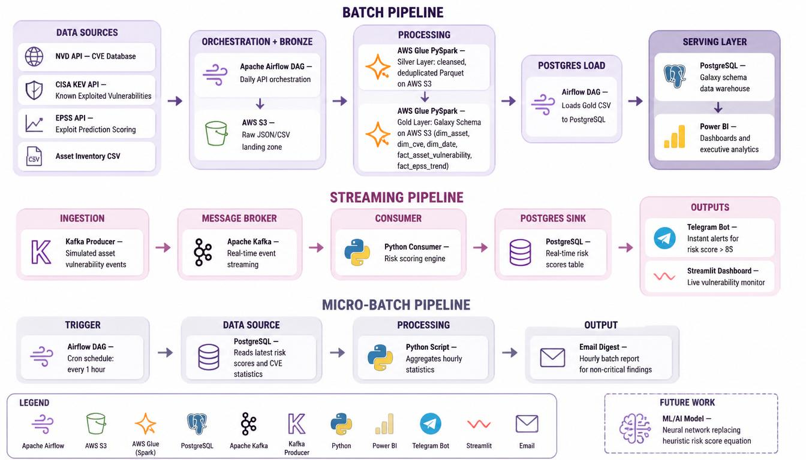

# Cyber Threat Intelligence Data Platform

A hybrid batch + streaming data pipeline that aggregates vulnerability feeds from NVD, CISA KEV, and EPSS, correlates them with asset inventory, and prioritizes patching based on composite risk scoring. Built on AWS cloud-native services with medallion architecture.

---

## Architecture Overview

<p align="center">
  
  <br>
  <em>Figure 1: Cyber Threat Intelligence Platform — Three-Pipeline Architecture</em>
</p>

---

## Data Sources

| Source | Type | Update Frequency | Data Provided |
|--------|------|-----------------|---------------|
| NVD CVE API | REST JSON | Daily batch | All CVEs with CVSS v2/v3/v4 scores |
| CISA KEV Catalog | JSON | Daily batch | Actively exploited vulnerabilities |
| EPSS API | REST JSON | Daily batch | Exploitation probability scores (0-1) |
| Asset Inventory | CSV | Static upload | Internal device/software inventory |

---

## Batch Pipeline (Medallion Architecture)

Runs daily at 3:00 AM via Apache Airflow:

| Stage | Layer | Technology | Output |
|-------|-------|-----------|--------|
| Extract | — | Airflow + Python | Raw API responses |
| Store | **Bronze** | AWS S3 | JSON/CSV as-is |
| Transform | **Silver** | AWS Glue PySpark | Cleansed Parquet |
| Model | **Gold** | AWS Glue PySpark | Galaxy Schema |
| Serve | — | Airflow + PostgreSQL | Structured warehouse |
| Visualize | — | Power BI | Executive dashboards |

### S3 Data Lake Structure

```
cyber-threat-intel-data-lake/
├── bronze/
│   ├── nvd/YYYY-MM-DD/nvd_cves.json
│   ├── cisa_kev/YYYY-MM-DD/cisa_kev.json
│   ├── epss/YYYY-MM-DD/epss_scores.json
│   └── assets/YYYY-MM-DD/asset_inventory.csv
├── silver/
│   ├── asset_inventory_clean/
│   ├── cisa_kev_clean/
│   ├── epss_scores/
│   └── cves_clean/
└── gold/
    ├── dim_asset/
    ├── dim_cve/
    ├── dim_date/
    ├── fact_asset_vulnerability/
    └── fact_epss_trend/
```

### Gold Layer — Galaxy Schema

| Table | Type | Key Fields |
|-------|------|-----------|
| `dim_asset` | Dimension | asset_key, asset_id, hostname, vendor, product, version, criticality |
| `dim_cve` | Dimension | cve_key, cve_id, description, baseScore, baseSeverity, cpe_vendor, cpe_product |
| `dim_date` | Dimension | date_key, full_date, year, month, day, quarter, is_weekend |
| `fact_asset_vulnerability` | Fact | asset_key, cve_key, date_key, risk_score, epss_score, is_cisa_exploited |
| `fact_epss_trend` | Fact | cve_key, date_key, epss_score, percentile |

---

## Streaming Pipeline

Real-time risk detection for critical vulnerabilities:

| Stage | Component | Purpose |
|-------|-----------|---------|
| Ingestion | Kafka Producer | Simulates asset vulnerability events |
| Broker | Apache Kafka | Decouples producer from consumer |
| Consumer | Python + psycopg2 | Calculates risk score, writes to DB |
| Sink | PostgreSQL | Persistent real-time scores |
| Alerts | Telegram Bot | Instant push for risk > 85 |
| Dashboard | Streamlit | Live monitoring UI |

### Risk Scoring Formula (Heuristic)

```
Risk Score = 
  (CVSS / 10 × 0.30) + 
  (EPSS × 100 × 0.30) + 
  (CISA_KEV × 10 × 0.20) + 
  (Criticality / 4 × 10 × 0.15) + 
  (Internet_Facing × 10 × 0.05)
```

| Priority | Score Range | Action |
|----------|-------------|--------|
| Urgent | ≥ 85 | Immediate Telegram alert |
| High | 70-84 | Patch within 24 hours |
| Medium | 50-69 | Schedule patch |
| Low | < 50 | Standard cycle |

---

## Micro-Batch Pipeline

Executive reporting without alert fatigue:

| Stage | Detail |
|-------|--------|
| Trigger | Airflow DAG, cron: `0 * * * *` (every hour) |
| Source | PostgreSQL — latest risk scores and CVE statistics |
| Processing | Python script aggregates hourly trends |
| Output | Email digest to stakeholders with non-critical findings |

---

## Tech Stack

| Layer | Technology | Role |
|-------|-----------|------|
| Orchestration | Apache Airflow | DAG scheduling, dependency management |
| Raw Storage | AWS S3 | Bronze/Silver/Gold data lake |
| Processing | AWS Glue (PySpark) | ETL, schema enforcement, deduplication |
| Warehouse | PostgreSQL | Structured serving layer |
| BI | Power BI | Executive dashboards |
| Streaming | Apache Kafka | Real-time event bus |
| Consumer | Python + Kafka | Risk scoring, alerting |
| Alerts | Telegram Bot API | Instant push notifications |
| Dashboard | Streamlit | Live streaming visualization |
| Reporting | Python + smtplib | Hourly email digests |

---

## Key Design Decisions

| Decision | Rationale |
|----------|-----------|
| Medallion architecture (Bronze/Silver/Gold) | Enables reprocessing, audit trail, and schema evolution |
| Galaxy Schema in Gold | Optimized for Power BI slicing and filtering |
| AWS Glue over EMR | Serverless, auto-scaling, native S3 integration |
| Kafka + Python (not Flink/Spark Streaming) | Simpler ops, sufficient for low-volume simulated events |
| Telegram over Slack/PagerDuty | Free, lightweight, no enterprise integration needed |
| Three separate pipelines | Clear separation of concerns: batch analytics, real-time alerts, executive reporting |

---

## Future Work

- **ML/AI Risk Model**: Replace heuristic formula with gradient boosting or neural network trained on historical exploitation data
- **Auto-Remediation**: Integrate with patch management APIs (WSUS, Ansible, Chef)
- **Threat Intelligence Graph**: Neo4j for CVE-asset-vendor relationship analysis
- **Federated Learning**: Train models across multiple organizations without sharing raw data

---

## Why This Matters

Without this platform, security teams discover critical vulnerabilities 12+ hours after publication. With streaming detection and risk-based prioritization, critical patches begin within **minutes** of a CVE hitting the NVD database — while non-critical findings are batched into digestible hourly reports.

---

## Getting Started

```bash
# 1. Clone repository
git clone https://github.com/yourusername/cyber-threat-intel-platform.git
cd cyber-threat-intel-platform

# 2. Set up environment
cp env_example .env
# Edit .env with your Telegram bot token and AWS credentials

# 3. Start infrastructure
docker-compose up -d  # Airflow, PostgreSQL, Kafka

# 4. Run batch pipeline
airflow dags trigger daily_vulnerability_ingestion

# 5. Start streaming
python kafka_consumer.py &
python kafka_producer.py

# 6. Launch dashboard
streamlit run dashboard.py
```

---

## Repository Structure

```
.
├── airflow_dags/
│   ├── daily_vulnerability_ingestion.py    # Bronze layer orchestration
│   ├── load_gold_to_postgres.py              # Gold → PostgreSQL
│   └── report_hourly_dag.py                # Micro-batch trigger
├── glue_jobs/
│   ├── silver_transform.py                   # Bronze → Silver
│   └── gold_transform.py                     # Silver → Gold (Galaxy Schema)
├── streaming/
│   ├── kafka_producer.py                     # Simulated events
│   ├── kafka_consumer.py                     # Risk scoring + alerts
│   └── streamlit_dashboard.py                # Live monitoring
├── reporting/
│   ├── unified_cve_reporter.py               # NVD/CISA analysis + email
│   └── report.py                             # Hourly digest script
├── infrastructure/
│   └── docker-compose.yml                    # Local stack
├── env_example                               # Configuration template
└── README.md                                 # This file
```

---

## License

MIT License — Capstone Project 2026